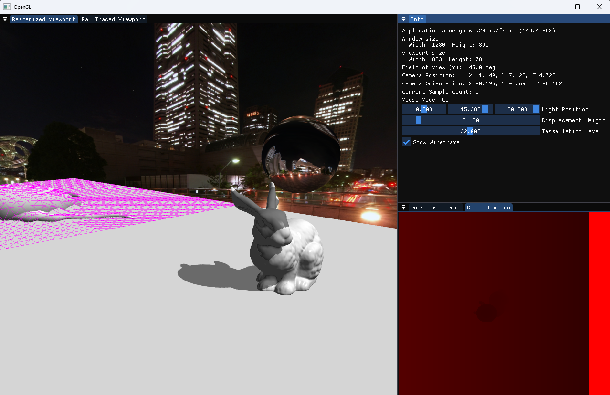
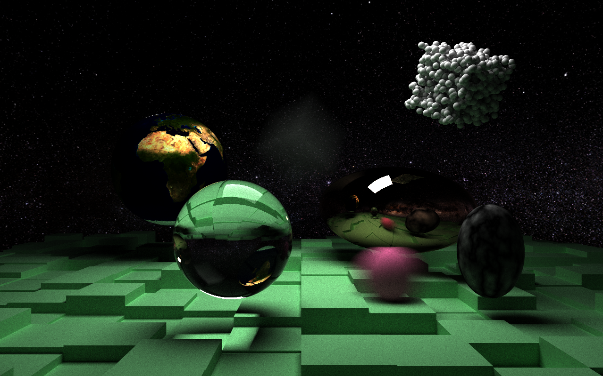

# MA's Graphics Explorations

A sandbox for exploring rasterized and ray traced rendering techniques. Made using MSVC, GLFW, and ImGui.

## OpenGL Renderer

Features:

- Triangle mesh loading
- Phong lighting with optional diffuse and specular textures
- Shadowmaps for area, point, and spot lights
- Environment maps
- Environment reflections
- Tessellation shaders
  - Displacement maps
- Geometry shaders
  - Wireframes

## CPU Path Tracer

Features:

- Importance sampling
- Bounding Volume Hierarchies (BVH)
  - Axis Aligned Bounding Boxes (AABBs)
- Procedural textures
  - Checkerboard
  - Perlin
  - Marble
- Constant density volumes
- Triangle meshes, spheres, planes, cubes
- Arbitrary matrix transformations (including non-uniform scaling)
- Environment maps
- Pinhole and thin lens cameras
